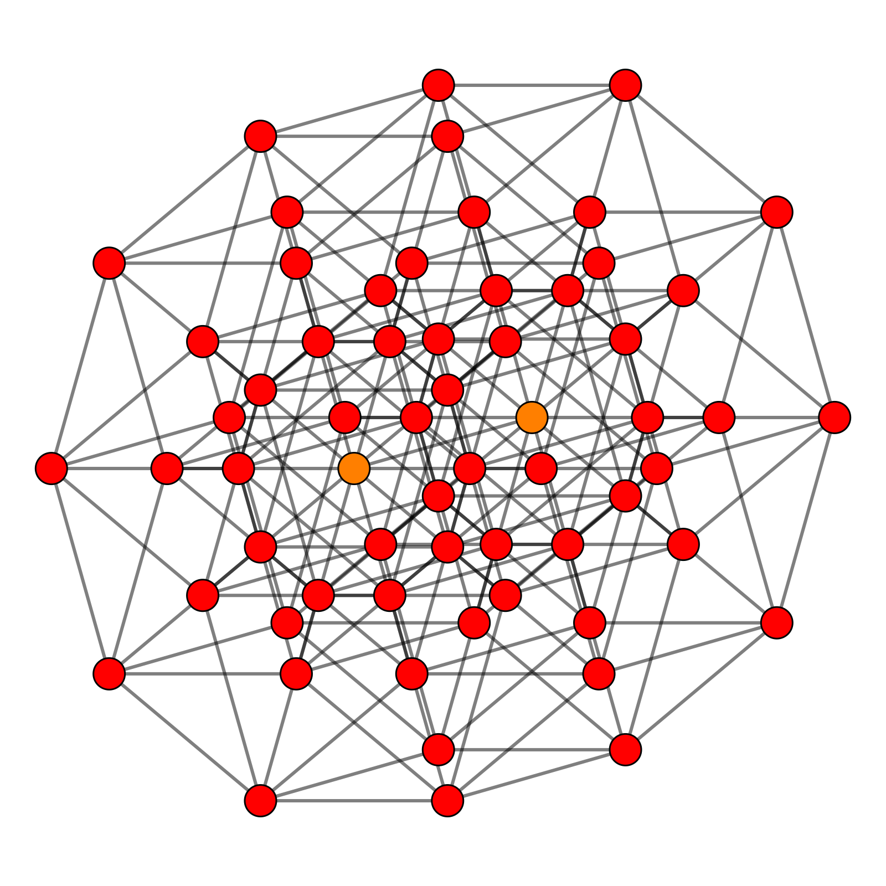

---
title: "Limits And Colimits in Haskell"
author: [Matthew Doty]
date: "2019-04-10"
subject: "Haskell"
keywords: [Haskell, Category Theory, Limits, Adjunctions]
lang: "en"
listings-disable-line-numbers: true
...

# Introduction to Adjunctions and Limits In Haskell

[//]: # (
```haskell
module Main where
import Control.Arrow ((&&&), (|||))
import Data.Bifunctor (bimap)
import Control.Applicative (Applicative, (<*>))
```
)

## Limits

Today I want to talk  about simple _limits_ and _colimits_ in Haskell.

Limits and colimits are objects in category theory.  They are defined in terms of functors. The full definition is a bit abstract.  I will start with an simple definition of a limit in Haskell due to Ed Kmett.  The original source can be found in [`category-extras`][1].

The mathematical notation for representing a limit for a functor $F$ is:

$$ \underset{\longrightarrow}{\lim}\;F $$

In Haskell a _limit_ is a universally quantified type constructor.  Arbitrary type constructors are used instead of functors in Haskell. This is because they make for simpler definitions. Here is a way to define a limit using a `newtype`:

```haskell
newtype Limit f = Limit { unLimit :: forall a. f a }
```

A _continuous_ functor is a functor that preserves limits.  This is like a continuous _function_ from calculus.  In calculus, a function is continuous whenever

$$ f \left( \lim_{i \to \infty} x_i \right) = \lim_{i \to \infty} f ( x_i ) $$

In category theory a functor $F$ is continuous if and only if:

$$ F \left(\underset{\longrightarrow}{\lim}\;G\right) \cong \underset{\longrightarrow}{\lim}(F \cdot G) $$

Here $F \cdot G$ denotes functor composition.  Haskell defines type constructor composition in the [`GHC.Generics`][2] module in `base`:

```haskell
infixr 7 :.:
newtype (:.:) f g p = Comp1 { unComp1 :: f (g p) }
```

A continuous type constructor has a pair of isomorphisms associated with it:

```haskell
class Continuous f where
  composeLimit   :: f (Limit g)
                 -> Limit (f :.: g)
  decomposeLimit :: Limit (f :.: g)
                 -> f (Limit g)
```

One example of a continuous functor is the reader monad `(->) r`.

```haskell
instance Continuous ((->) r) where
  composeLimit r2LimitG =
    Limit $ Comp1 (unLimit . r2LimitG)
  decomposeLimit limit r =
    Limit $ (unComp1 (unLimit limit)) r
```

There is a general reason the reader monad is continuous.  It follows from the theory of _adjoint functors_.

## Adjunctions

_Adjunctions_ are fundamental relationships in category theory.  Let [$\hom(A,B)$][3] denote the _hom-set_ of morphisms between objects $A$ and $B$ in a category. Two functors $F$ and $G$ are adjoint if and only if, for all objects $X$ and $Y$:

$$hom(F X, Y) \cong hom(X, G Y)$$

In this case we say $F$ is the _left_ adjoint and $G$ is the _right_ adjoint.  In mathematical shorthand denotes this relationship with $F \dashv G$.

In Haskell there is an _internal_ hom-set.  It is the function arrow `(->)`.  Following [`Data.Functor.Adjunction`][4], adjunctions are defined in Haskell by:

```haskell
class (Functor f, Functor u)
  => Adjunction f u | f -> u, u -> f where
    leftAdjunct  :: (f a -> b) -> a -> u b
    rightAdjunct :: (a -> u b) -> f a -> b
```

One adjunction in Haskell is between the _product comonad_ `(,) r` and the _reader monad_ `(->) r`:

```haskell
instance Adjunction ((,) r) ((->) r) where
  leftAdjunct  = flip . curry
  rightAdjunct = uncurry . flip
```

This adjunction is key to why `(->) r` is continuous.  In order to see this it is helpful to understand some properties of adjunctions.

## Uniqueness of Adjunctions

Adjoints are _unique up to isomorphism_.  For right adjoints this means that if $F \dashv G$ and $F \dashv H$ then $G X \cong H X$ for all $X$. Left adjoints are similar.  In Haskell this is expressed by constructing a pair of _natural transformations_.  The [`indexed`][5] module defines natural transformations as:

```haskell
infixr 0 ~>
type f ~> g = forall x. f x -> g x
```

Type constructors `f` and `g` are isomorphic if and only if there are two functions `via :: f ~> g` and `from :: g ~> f`.  This relationship is captured in the `NaturalIsomorphism` data type:

```haskell
data NaturalIsomorphism f g =
  NaturalIsomorphism { via  :: f ~> g
                     , from :: g ~> f
                     }
```

If type constructors share a common left or right adjoint then there is an introduction rule for an `Isomorphism`:

```haskell
rightAdjunctionsIso :: (Adjunction f u, Adjunction f v)
                    => NaturalIsomorphism u v
rightAdjunctionsIso =
  NaturalIsomorphism  { via = nat , from = nat } where
    nat :: (Adjunction f u, Adjunction f v) => u ~> v
    nat = leftAdjunct $ rightAdjunct id

leftAdjunctionsIso :: (Adjunction f u, Adjunction g u)
                   => NaturalIsomorphism f g
leftAdjunctionsIso =
  NaturalIsomorphism { via = nat, from = nat } where
    nat :: (Adjunction f u, Adjunction g u) => f ~> g
    nat = rightAdjunct $ leftAdjunct id
```

Uniqueness up to isomorphism means we can speak of _the_ left/right adjoint to a particular functor.

## Applicatives and Coapplicatives

The left adjoint of an `Applicative` is a `Coapplicative` and vice versa. While `Applicative`s are familiar `Coapplicative`s are obscure. Conor McBride introduced them in [_Decisive Functors_ (2007)][6]. He starts with the _lax monoidal_ formulation of an applicative:

```haskell
class Functor f => LaxMonoidalApplicative f where
  unit :: a -> f a
  zip  :: (f a, f b) -> f (a, b)
```

This type class is equivalent to the `Applicative` type class in `Control.Applicative`.  As Conor points out, it has a _dual_. He calls the dual class `Decisive` functors.  Calling it a `Coapplicative` makes it clearer it is a dual:

```haskell
class Functor f => Coapplicative f where
  extract :: f a -> a
  cozip   :: f (Either a b) -> Either (f a) (f b)
```

This is in part because all left adjoints preserve _finite coproducts_:

```haskell
uncozip :: Functor f
        => Either (f a) (f b)
        -> f (Either a b)
uncozip = fmap Left ||| fmap Right

cozipL :: Adjunction f u
       => f (Either a b)
       -> Either (f a) (f b)
cozipL = rightAdjunct
  (leftAdjunct Left ||| leftAdjunct Right)
```

Dually, all right adjoints preserve _finite products_:

```haskell
unzip :: Functor f => f (a, b) -> (f a, f b)
unzip xs = (fst <$> xs, snd <$> xs)

zipR :: Adjunction f u => (u a, u b) -> u (a, b)
zipR = leftAdjunct (rightAdjunct fst &&& rightAdjunct snd)
```

Here `unzip` can be found in [`Data.List.NonEmpty`][7]. The others can be found in [`Data.Functor.Adjunction`][8].

The `Coapplicative` instance for a left adjoint of an `Applicative` follows. However, it is hard to express this in Haskell. Trying to write `instance (Applicative u, Adjunction f u) => Coapplicative f where ...` leads to compilation problems.  Instead it is easier to introduce two newtypes with _phantom_ parameters:

```haskell
newtype RightAdjoint f u a =
  RightAdjoint { unRightAdjoint :: u a } deriving Functor

newtype LeftAdjoint f u a =
  LeftAdjoint { unLeftAdjoint :: f a } deriving Functor

instance Adjunction f u
  => Adjunction (LeftAdjoint f u) (RightAdjoint f u) where
    leftAdjunct f  = RightAdjoint
                   . leftAdjunct (f . LeftAdjoint)
    rightAdjunct g = rightAdjunct (unRightAdjoint . g)
                   . unLeftAdjoint
```

Using the newtype wrappers the `Coapplicative` instance can be presented without issues:

```haskell
instance (Adjunction f u, Applicative u)
  => Coapplicative (LeftAdjoint f u) where
    extract = rightAdjunct pure . unLeftAdjoint
    cozip   = bimap LeftAdjoint LeftAdjoint
            . cozipL
            . unLeftAdjoint
```

There is also the dual `Applicative` instance for a right adjoint:

```haskell
instance (Adjunction f u, Coapplicative f)
  => Applicative (RightAdjoint f u) where
    pure = RightAdjoint . leftAdjunct extract
    (RightAdjoint uf) <*> (RightAdjoint ua) =
      RightAdjoint $ uncurry ($) <$> (curry zipR) uf ua
```

Both left and right adjoints preserve algebraic structure.  This is why the `Applicative` and `Coapplicative` instances are straightforward to provide.  Left adjoints preserve finite sums, while right adjoints preserve finite products.

Extending the observation here is key to why `(->) a` is continuous.

## Adjunctions, Continuity and Cocontinuity

Adjunctions are related not only to continuity but _cocontinuity_ as well. Just as the notation for a limit is $\underset{\longrightarrow}{\lim} F$, a _colimit_ has similar notation:

$$ \underset{\longleftarrow}{\lim}\;F $$

In Haskell a colimit is an existential quantifier.  This reflects how limits are universal quantifiers:

```haskell
data Colimit f = forall b. Colimit (f b)
```

The dual notion of _cocontinuous_ is very similar to continuity.  A functor $F$ is _cocontinuous_ if and only if:

$$ F \left(\underset{\longleftarrow}{\lim}\;G\right) \cong \underset{\longleftarrow}{\lim}(F \cdot G) $$

In Haskell this is represented by another isomorphism:

```haskell
class Cocontinuous f where
  composeColimit   :: f (Colimit g)     -> Colimit (f :.: g)
  decomposeColimit :: Colimit (f :.: g) -> f (Colimit g)
```

A limit is a sort of infinitary product.  A colimit is a sort of infinitary sum.  Continuity and cocontinuity are about preserving this algebraic structure.

Left adjoints are _cocontinuous_:

```haskell
instance Adjunction f u
  => Cocontinuous (LeftAdjoint f u) where
    composeColimit = rightAdjunct
      $ \case (Colimit ga) -> leftAdjunct (Colimit . Comp1) ga
    decomposeColimit (Colimit fg) =
      fmap Colimit . unComp1 $ fg
```

And right adjoints are _continuous_:

```haskell
instance Adjunction f u
  => Continuous (RightAdjoint f u) where
    composeLimit uLimitG =
      Limit $ Comp1 . fmap unLimit $ uLimitG
    decomposeLimit =
      leftAdjunct (\fLimitUG ->
        Limit $ rightAdjunct (unComp1 . unLimit) fLimitUG)
```

\begin{tikzpicture}
% title:     My Tikz Picture
% caption:   Some cool caption
% id:        mytikzpic_id
% class:     mytikzpic_class1
% class:     mytikzpic_class2
% attr1:     Random Attribute 1
% attr2:     Random Attribute 2

\def \n {5}
\def \radius {3cm}
\def \margin {8} % margin in angles, depends on the radius

\foreach \s in {1,...,\n}
{
  \node[draw, circle] at ({360/\n * (\s - 1)}:\radius) {$\s$};
  \draw[->, >=latex] ({360/\n * (\s - 1)+\margin}:\radius)
    arc ({360/\n * (\s - 1)+\margin}:{360/\n * (\s)-\margin}:\radius);
}
\end{tikzpicture}

{.class width=30 height=20px}

[1]: https://github.com/ekmett/category-extras/blob/6347b17608539936de73ee2cc1e997b3e8396a31/Control/Functor/Limit.hs#L24-L45
[2]: https://github.com/ghc/packages-base/blob/52c0b09036c36f1ed928663abb2f295fd36a88bb/GHC/Generics.hs#L611-L614
[3]: https://ncatlab.org/nlab/show/hom-set
[4]: https://github.com/ekmett/adjunctions/blob/af0b615ddae935feaae81a246c1003d2668a1a0d/src/Data/Functor/Adjunction.hs#L92-L105
[5]: https://github.com/ekmett/indexed/blob/331b5dd12eee9dfa89d8bf2dda18dce04030167b/src/Indexed/Types.hs#L51-L73
[6]: https://web.archive.org/web/20190415113518/https://fplab.bitbucket.io/posts/2007-07-08-decisive-functors.html
[7]: https://hackage.haskell.org/package/base-4.12.0.0/docs/src/Data.List.NonEmpty.html#unzip
[8]: https://hackage.haskell.org/package/adjunctions-4.4/docs/Data-Functor-Adjunction.html

[///]: # (
```haskell
main = pure ()
```
Local Variables:
eval: (projectile-mode)
compile-command: "make -C .. 20190410_Adjunctions_and_Continuity-haskell-check all"
projectile-project-compilation-cmd: "make 20190410_Adjunctions_and_Continuity-haskell-check all"
End:
)
