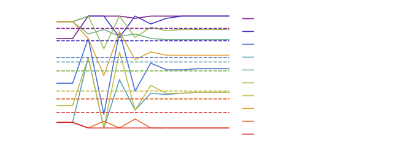
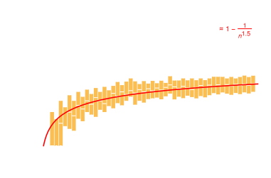
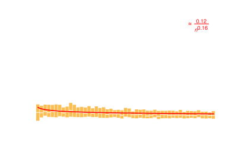
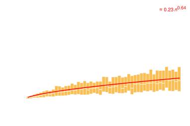

---
title: "An Application of Machine Learning To Protect Against Sure Loss in Games of Chance"
author: [Matthew Doty, Varun Mazumdar]
date: "May 28th, 2019"
subject: "Gambling, Probability and Machine Learning"
keywords: [Gambling, Probability, Convex Optimization, Machine Learning]
lang: "en"
beamer: true
...

# About Me

 - Sr. software engineer
 - Co-designed the ASIC-resistant mining algorithm for Ethereum
 - Worked on the Transiting Exoplanet Survey Sattelite (TESS) for NASA/MIT
 - Amateur mathematician

# What this Talk is About

Gamblers can make bets where they lose money no matter the outcome.

_How can we apply machine learning techniques to avoid this?_

# Kentucky Derby Prop Bets Arbitrage (1)

On [PredictIt.org](https://www.predictit.org/) bets cost $X¢$ and pay out $\$1$.

Using this format (rather than odds), I offer to make three prop bets with you:

  - $90¢$ for _Country House_ to finish before _Tacitus_
  - $90¢$ for _Tacitus_ to finish before _Improbable_
  - $90¢$ for _Improbable_ to finish before _Country House_

*How much money are you guaranteed to make?*

# Kentucky Derby Prop Bets Arbitrage (2)

When I make all these bets I will give you $\$2.70$.

It will never be true that

  - "$A$ before $B$"
  - "$B$ before $C$"
  - "$C$ before $A$"

...all at once!

You have to pay $\$2.00$ _at most_.

That is at least $70¢$ profit, _always_.

# Kentucky Derby Prop Bets Regression (1)

What is the nearest triple of bets $\langle X¢, X¢, X¢ \rangle$ to $\langle 90¢, 90¢, 90¢ \rangle$ such that you cannot guarantee a profit?

  - $X¢$ for _Country House_ to finish before _Tacitus_
  - $X¢$ for _Tacitus_ to finish before _Improbable_
  - $X¢$ for _Improbable_ to finish before _Country House's_

# Kentucky Derby Prop Bets Regression (2)

You have to pay $\$2.00$ at most.

So if I bet $\langle66.\bar{6}¢,66.\bar{6}¢,66.\bar{6}¢\rangle$ you are
not _guaranteed_ a profit.

(I can break even.)

By finding the nearest non-strictly-losing set of bets we have managed a
kind of _least squares regression_.

# Reservation Price

I can at best break even with the price of $66.\bar{6}¢$ for each bet.

_$66.\bar{6}¢$ reflects the most I should ever pay._

In auction theory this called my _reservation price_ [@myersonOptimalAuctionDesign1981].

# Goal of This Talk

We have computed my _least squares regressed reservation price_ from a collection of losing bets in a simple example.

The rest of this talk looks at a general algorithm for doing this using machine learning techniques.

# Mathematical Background: Dutch Books

My poor gambling strategy has fallen prey to what probability theorists call a _Dutch Book_.

A theorem from the _subjectivist_ school of probability provides sufficient conditions to avoid this [@ramseyTruthProbability1926].

Probability theory states my bets should follow a _probability measure_ or be vulnerable to arbitrage.

# Mathematical Background: Probabilistic Satisfaction

Determining if my bets follow a probability measure is called _Probilistic Satisfaction_ (PSAT) in computer science [@georgakopoulosProbabilisticSatisfiability1988].

PSAT is about finding a feasible $P$ to matrix equation [@nilssonProbabilisticLogic1986]:

$$ \Pi = V P$$

   - $\Pi$ is a vector of my initial bet prices
   - $V$ is a binary design matrix reflecting the outcomes where I recieve a payout or not
   - $P$ is a vector reflecting the _weights_ of each possible outcome obeying $\forall p \in P. 0 \leq p \leq 1$ and $\sum_{p \in P} p = 1$

# Mathematical Background: Least Squares Optimization

I care about a related problem to PSAT.

I want to compute the least squares optimization:

$$ \mathrm{argmin}_P \lVert \Pi - V P \rVert^2 $$

...where $0 \leq P \leq 1$ and $\sum_{p \in P} p = 1$ as before.

Here $\lVert \cdot \rVert^2$ is the $L2$ norm.

_My regressed bets are $A \hat{P}$ using the least squares minimizing $\hat{P}$._

# Mathematical Background: Machine Learning

_Convex Optimization_ is a common approach to machine learning.

One algorithm for solving $\mathrm{argmin}_P \lVert \Pi - V P \rVert^2$ is _projected gradient descent_.

In projected gradient descent successive approximations $P_1, P_2, \ldots$ of the solution are computed with:

$$ P_{n+1} = \pi \left(P_n - t_n \nabla_P \lVert \Pi - V P_n \rVert^2  \right) $$

  - $\pi$ is a projection that finds the nearest vector $X$ where $0 \leq X \leq 1$ and $\sum_{x\in X} x = 1$  [@wangProjectionProbabilitySimplex2013].
  - If $t_n = \frac{1}{n}$ this is guaranteed to converge [@boydSubgradientMethods2003].

# Kentucky Derby Simulation

To test the regression, I simulated random exotic horse bets in the Kentucky Derby (20 horses).

Simulate collections of 2 to 50 bets, 200 samples each.

Random bets include

 - Win $X$, where horse $X$ comes in first
 - Place $X$, where a horse $X$ comes in first or second
 - Exacta $X$ $Y$, where horse $X$ comes in first and horse $Y$ comes in second
 - Quinella $X$ $Y$, where both horse $X$ and $Y$ place
 - Lay bets against horses winning, placing, exacta bets and quinella bets

# Regression Algorithm In Action (1)

# Regression Algorithm In Action (2)

Observations:

  - The projected subgradient descent is turbulent at the start as it sorts out inconsistency.
  - Lay bets tend to increase while other bets tend to decrease.
  - _Regression cautions restraint._ According to the algorithm I should avoid many of the bets I initially entertained.

# Avoided Bets (1)

As I make more bets, the algorithm suggests I avoid more bets too.

This is because as I make more bets I am more likely to miscalculate.

# Avoided Bets (2)

# Avoided Bets (3)

If I make $n$ bets the frequency of bets I should avoid grows like $\approx 1 -\frac{1}{n^{1.5}}$

As $n \to \infty$, $1 -\frac{1}{n^{0.15}}$ tends to $1$.

In the limit, I should not take any bets at all!

# Loss Per Bet (1)

# Loss Per Bet (2)

As I make more bets, my loss per bet declines as $\frac{0.12}{n^{0.16}}$.

In the limit, my loss per bet converges to zero.

_Paradoxically, in the limit I should take no bets just as my loss per bet goes to 0!_

# Estimated Loss to Arbitrage

# Conclusion

  - A new machine learning technique for finding vulnerabilities in portfolios has been introduced.
  - The algorithm is currently limited and somewhat slow.  It needs to be sped up and made more general.
  - Hopefully the algorithm is applicable to finance and other games of chance.

# References

[///]: # (
Local Variables:
eval: (projectile-mode)
compile-command: "make all"
projectile-project-compilation-cmd: "make all"
End:
)
